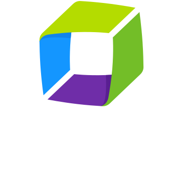
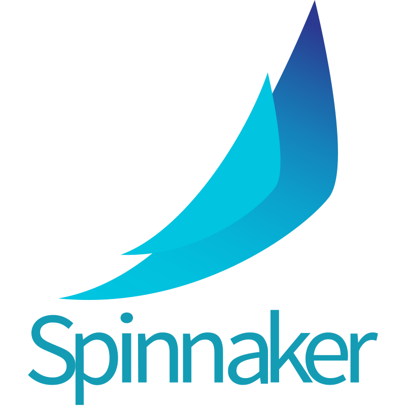

<h2 align="center">Hey there! 👋 I am Anupam Yadav. 🤓</h2>

I work as a Cloud and DevOps Consultant. I hold a Bachelor's degree (Bachelor of Technology - B.Tech) focused in Computer Science from Meerut Institute of Engineering and Technology (MIET), Meerut affiliated to Dr. A.P.J. Abdul Kalam Technical University, Lucknow, Uttar Pradesh, India (Formerly Uttar Pradesh Technical University).

 🌱 On a never-ending quest of learning &nbsp; 📫 Reach out to me on LinkedIn 

  
  

---
### Worked on so far

       
       
       
       
       
       
       
      
      
      

     
      
      
      
      
      
      
      
      
      

     
     
     
      
      
      
      
      
      
      

      

      
      
      

---

### My Github Statistics

  
  

  
  

  
  

