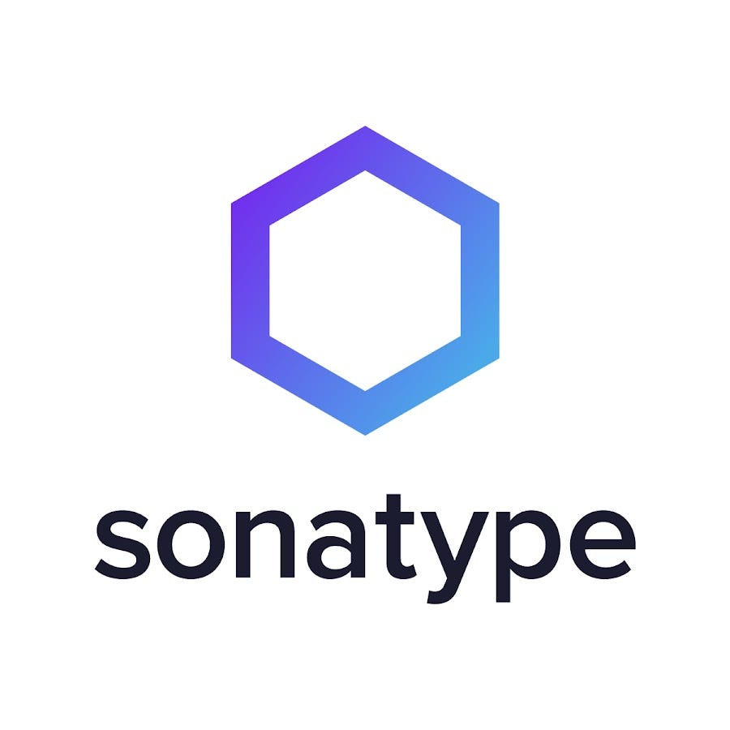
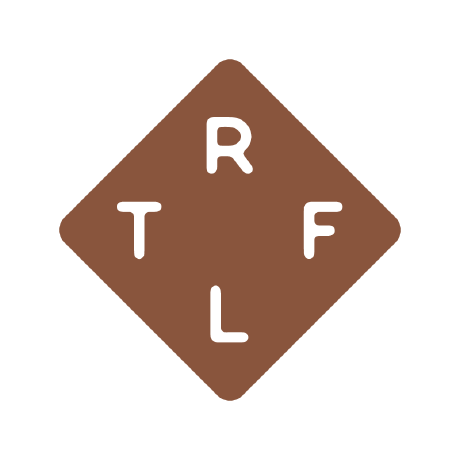
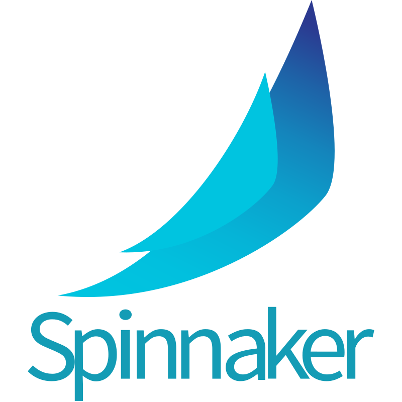
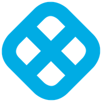
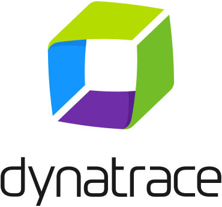
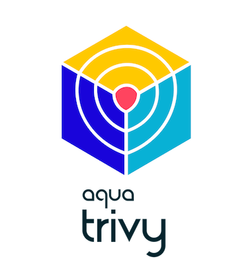
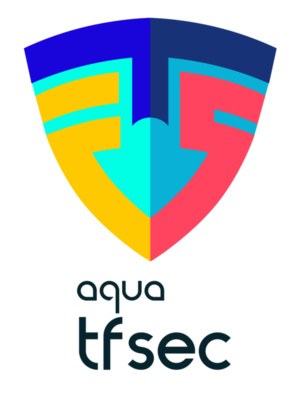
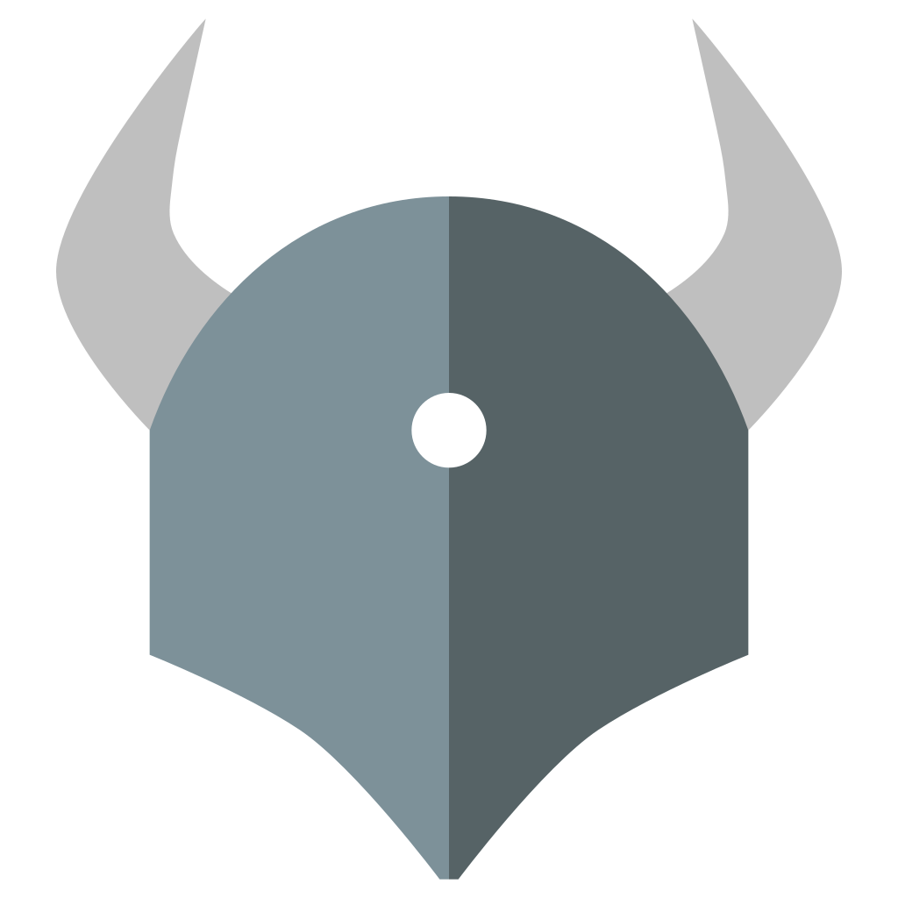

<h2>Hi, I'm Anupam. 👋</h2>

📍 Delhi, India ↔ London, UK  
💼 HCLTech | Ex-Rackspace, Publicis Sapient  
🚀 Actively upskilling. On a never-ending quest of learning!

## 🌐 Socials

## 🛠️ Projects
- 👨‍💻 **[terracore](https://oneanupam.github.io/terracore/)** - the terraform learning project using google cloud for beginners.
- 🌿 **[seapp](https://github.com/oneanupam/seapp-flask)** - a small example app written in flask framework for learning purposes.

## 💻 Tech Stack

  
  
  
  
  
  
  
  
  
  
  
  
  
  
  
  
  
  
  
  
   
  
  
  
  
  
  
  
  
  
  
  
  
  
  
  
  
  
  
    
  
  
    
  
  
  
  
    
  

## 📊 GitHub Stats
<!-- 
  
  

  
  

-->

  
  

